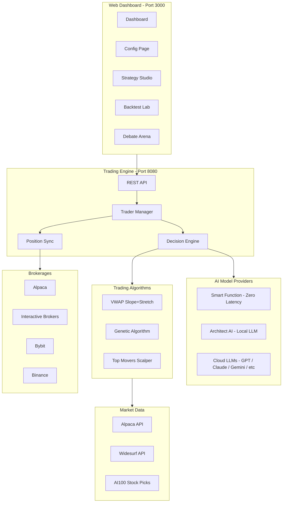
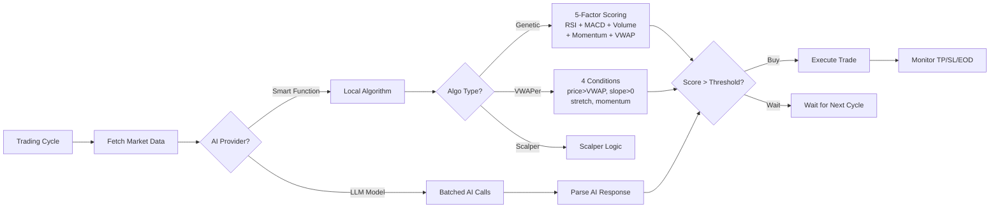

# SynapseStrike - AI-Powered Trading Ecosystem

**A complete AI trading platform combining local LLMs, algorithmic strategies, and automated execution across multiple brokerages.**

---

## Architecture



## Decision Flow



---

## Repository Structure

```
SynapseStrike/
├── SynapseStrike/          # Go trading platform (core)
│   ├── api/                # REST API handlers
│   ├── trader/             # Auto-trader, position sync, VWAP collector
│   ├── decision/           # Decision engine + Local Function algorithms
│   ├── mcp/                # Multi-model AI clients (10+ providers)
│   ├── market/             # Market data (Alpaca, Widesurf, AI100)
│   ├── backtest/           # Backtest Lab engine
│   ├── store/              # SQLite database layer
│   ├── web/                # React frontend (TypeScript)
│   └── docker/             # Dockerfiles
├── AIArchitect/            # Python decision pipeline backend
├── LocalAI/                # Self-hosted LLM infrastructure
├── install.sh              # Interactive installer
└── README.md
```

---

## Key Features

### Smart Function (Local Algorithm Engine)
- **Zero latency, zero API cost** -- pure algorithmic trading decisions
- Auto-detects algo type (VWAPer, Genetic, Scalper) from strategy config
- 3 model profiles per algo (different parameter aggressiveness)
- Full Chain of Thought trace showing every condition checked

### Genetic Algorithm Trading
Multi-factor stock scoring with pre-evolved chromosome weights:

| Factor | What It Measures | Peak Score |
|--------|-----------------|------------|
| RSI | Neutral zone (40-60) = opportunity | 100 at RSI 50 |
| MACD | Bullish crossover + rising | 100 when positive + rising |
| Volume | Institutional interest (2x+ avg) | 100 at 3x surge |
| Momentum | Sweet spot +1-5% from open | 100 at +3% |
| VWAP | Price 0-1% above VWAP | 100 right at VWAP |

Three pre-evolved chromosome profiles:
- **Model 1 (Aggressive)**: Heavy volume + momentum, low threshold (55)
- **Model 2 (Balanced)**: Even weights, medium threshold (65)
- **Model 3 (Conservative)**: Heavy VWAP, high threshold (75)

### VWAP Slope + Stretch Algorithm
Adaptive VWAP entry at configurable time with 4 conditions:
- Price > VWAP (trading above average)
- VWAP slope positive (buyers in control)
- Stretch < 0.5x volatility (not overextended)
- Momentum > 0.25x volatility (solid move)
- TP from AI100 optimization API, SL at day's open

### Batched AI Calls
- Splits large stock lists into batches of 2 to fit within LLM context limits
- Sequential processing with per-batch error handling
- Failed batches skip gracefully, remaining continue
- Supports Qwen3, GPT, Claude, Gemini, Grok, DeepSeek, and more

### Bulletproof Error Handling
- Universal fallback catches ALL AI errors (not just specific ones)
- Exponential backoff retry (2s, 4s, 8s, 16s...)
- 20+ retryable error patterns (429, 503, rate limits, quota, etc.)
- Algorithmic fallback when AI is unavailable
- Full error context preserved in Chain of Thought

### Trader Position Isolation
- Ownership guard prevents one trader from closing another's positions
- Database-verified ownership check before every close operation
- Safe for multiple traders sharing the same brokerage account

### Configurable End-of-Day Close
- Per-strategy toggle: close positions before market close or hold overnight
- Configurable close time (default 3:55 PM ET)
- VWAPer/Scalper = close at EOD, Swing = hold overnight

### Backtest Lab
- Strategy-based backtesting (no manual symbol input needed)
- Widesurf data source (Polygon-compatible API)
- Simulated time picker (backtest at any time of day)
- Model dropdown matches dashboard names

---

## Supported AI Models

| Provider | Default Model | Type |
|----------|--------------|------|
| Smart Function | model_1 / model_2 / model_3 | Local algorithm (zero cost) |
| Architect AI | Qwen3-32B-AWQ | Local LLM (self-hosted) |
| DeepSeek | deepseek-chat | Cloud API |
| OpenAI | gpt-5.2 | Cloud API |
| Claude | claude-opus-4-5 | Cloud API |
| Gemini | gemini-3-pro-preview | Cloud API |
| Grok | grok-3-latest | Cloud API |
| Qwen | qwen3-max | Cloud API |
| Kimi | moonshot-v1-auto | Cloud API |
| Local AI | custom model | Self-hosted OpenAI-compatible |

---

## Service Endpoints

| Service | Port | Description |
|---------|------|-------------|
| Trading Platform | 3000 | Web dashboard |
| Backend API | 8080 | REST API |
| LocalAI | 8050 | Self-hosted LLM |
| AIArchitect | 8065 | Decision pipeline |
| Main LLM (vLLM) | 8060 | Qwen3-32B inference |
| Embeddings | 8062 | BGE-large embeddings |
| Qdrant | 8063 | Vector database |
| PostgreSQL | 8064 | Trade logs |

---

## Quick Start

### Prerequisites
- **Docker** with Docker Compose
- **NVIDIA GPU** with 24GB+ VRAM (recommended) or CPU
- **Linux/macOS** (Windows via WSL2)

### One-Command Install

```bash
./install.sh
```

### Manual Start

```bash
# Start trading platform
cd SynapseStrike
cp .env.example .env  # Edit with your API keys
./start.sh start --build

# Access dashboard
open http://localhost:3000
```

### Configuration

1. **Add Brokerage**: Config > Brokerages > Add Alpaca (paper or live)
2. **Add AI Model**: Config > AI Models > Choose provider + enter API key
3. **Create Strategy**: Strategy Studio > New > Configure stock source + algorithms
4. **Create Trader**: Config > Create Trader > Select model + strategy + brokerage
5. **Start Trading**: Click "Start" on your trader

---

## Hardware Requirements

| Tier | GPU | RAM | Use Case |
|------|-----|-----|----------|
| Minimum | None (CPU) | 32GB | Smart Function only |
| Recommended | RTX 3090 (24GB) | 64GB | Local LLM + Smart Function |
| Optimal | 2x RTX 3090 | 128GB | Full stack with Qwen3-32B |

---

## Cost Comparison

| Approach | Monthly Cost | Latency |
|----------|-------------|---------|
| Cloud LLMs (GPT/Claude) | $300-1000/mo | 2-30s per decision |
| Self-hosted LLM (Qwen3) | $30/mo (electricity) | 5-30s per decision |
| **Smart Function** | **$0** | **<1ms per decision** |

---

## Contributing

See [CONTRIBUTING.md](./CONTRIBUTING.md) for guidelines.

## License

Apache 2.0 - See [LICENSE](./LICENSE)

## Disclaimer

**Trading involves substantial risk of loss. This software is for educational and research purposes. Past performance does not guarantee future results. Use at your own risk.**

---

**Built for traders who value privacy, control, and cost efficiency.**
